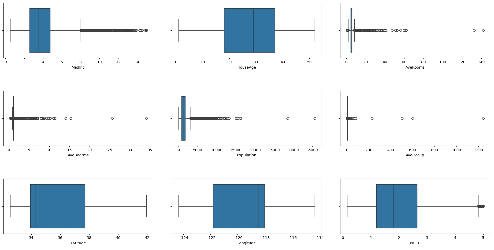

# California-House-Price-Predictor
ML project to predict median house value in California district using California Housing dataset.
Try it out: https://andrewxyzee-california-house-price-predictor.streamlit.app/
### Demo


Seaborn and matplotlib.pyplot used to identify potential data improvments ([see_data_review](data_review.py)).  

Pandas and numpy used to modify data/ create features.  
Scikit-learn and joblib to create model.  
Streamlit to create an app.  
  
Model accuracy with RAW data ([see_raw_model](model_raw/train_model_raw.py)):  
RMSE 0.7456  
R2: 0.5758  
  
Model accuracy after improvments:  
RMSE: 0.5609  
R2: 0.6528  
  
### To open app locally:
```bash
pip install -r requirements.txt
streamlit run app.py
```
